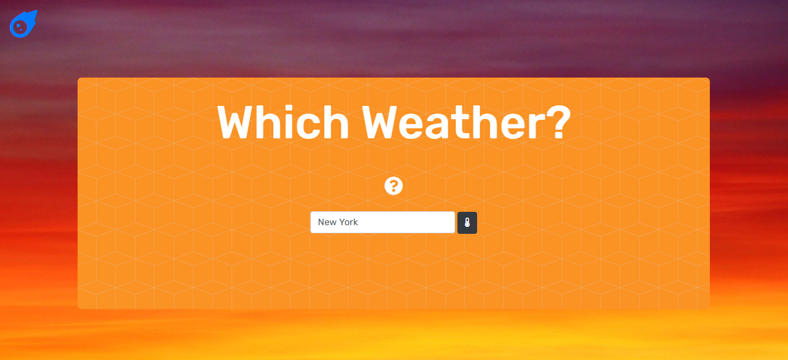
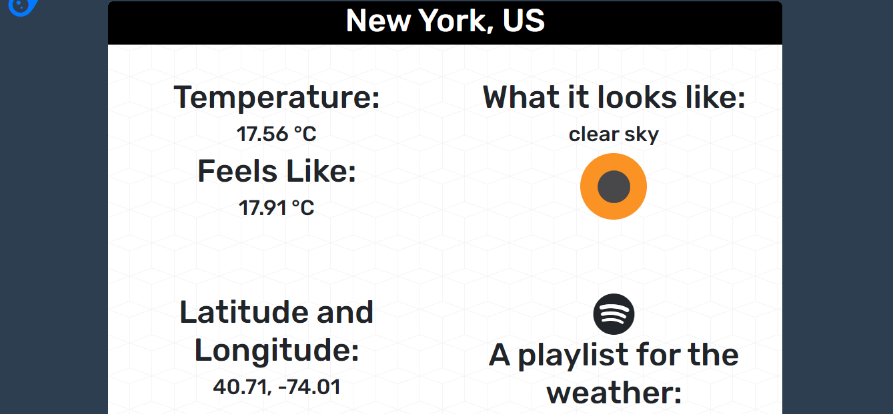

[![Contributors][contributors-shield]][contributors-url]
[![Forks][forks-shield]][forks-url]
[![Stargazers][stars-shield]][stars-url]
[![LinkedIn][linkedin-shield]][linkedin-url]

<!-- PROJECT LOGO -->
 

  

  

  <h3 align="center">Which Weather?</h3>

  

    An app that let's you checkout the weather of cities around the world.
     
    <a href="https://github.com/DenEdwards/Weather-App"><strong>Explore the docs »</strong></a>
     
     
    <a href="https://which-weather-app.herokuapp.com/">View Demo</a>
  

<!-- TABLE OF CONTENTS -->
## Table of Contents

* [About the Project](#about-the-project)
  * [Built With](#built-with)
* [Getting Started](#getting-started)
* [Contact](#contact)
* [Acknowledgements](#acknowledgements)

<!-- ABOUT THE PROJECT -->
## About The Project

A website that let's user checkout the temperature, latitude and longitude, and a playlist for that weather. 

<!-- CONTACT -->
## Contact

[Denzel Edwards](https://https://denedwards.github.io/)

Project Link: [https://github.com/DenEdwards/Weather-App](https://github.com/DenEdwards/Weather-App)

<!-- ACKNOWLEDGEMENTS -->
## Acknowledgements
* [Heroku](https://heroku.com)
* [Img Shields](https://shields.io)

<!-- MARKDOWN LINKS & IMAGES -->
<!-- https://www.markdownguide.org/basic-syntax/#reference-style-links -->
[contributors-shield]: https://img.shields.io/github/contributors/DenEdwards/Weather-App.svg?style=flat-square
[contributors-url]: https://github.com/DenEdwards/Weather-App/graphs/contributors

[forks-shield]: https://img.shields.io/github/forks/DenEdwards/Weather-App.svg?style=flat-square
[forks-url]: https://github.com/DenEdwards/Weather-App/network/members

[stars-shield]: https://img.shields.io/github/stars/DenEdwards/Weather-App.svg?style=flat-square
[stars-url]: https://github.com/DenEdwards/Weather-App/stargazers

[issues-shield]: https://img.shields.io/github/issues/DenEdwards/Weather-App
[issues-url]: https://github.com/DenEdwards/Weather-App/issues

[linkedin-shield]: https://img.shields.io/badge/-LinkedIn-black.svg?style=flat-square&logo=linkedin&colorB=555
[linkedin-url]: https://www.linkedin.com/in/denzel-edwards-093927170/